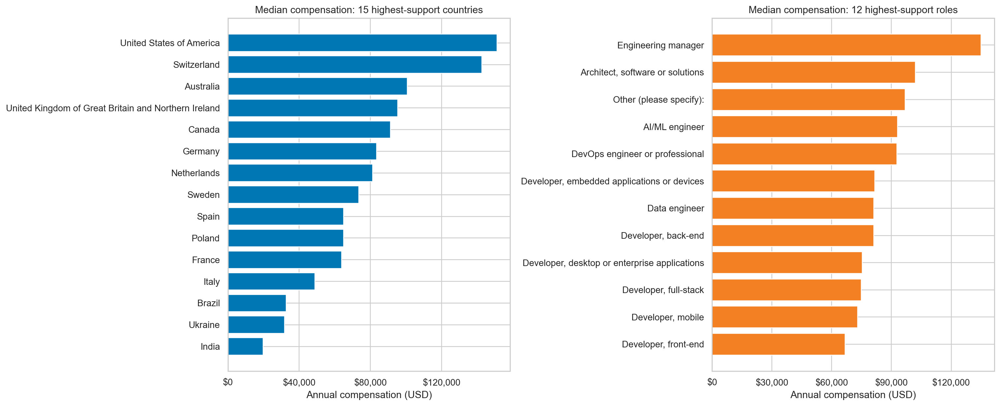
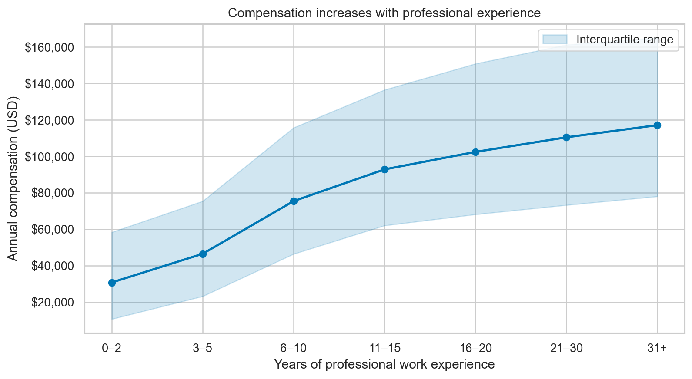
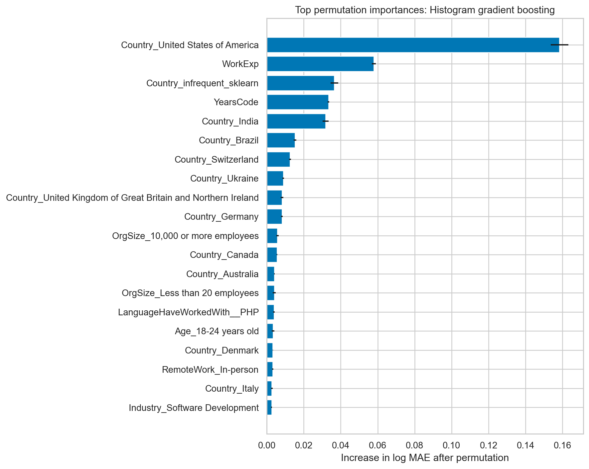

# What Really Predicts Developer Pay? Country and Experience Beat Individual Technologies

Developer compensation discussions often focus on the newest language or
framework. But does an individual technology really tell us much about pay?
I analyzed the 2025 Stack Overflow Developer Survey to find out.

I focused on 19,025 professional developers who were employed or self-employed
and reported annual compensation between USD 1,000 and USD 1 million. The
sample is global, so the results describe survey respondents—not every
developer or a universal salary market.

## Experience matters, but location changes the scale

Median compensation rose steadily with professional experience: from USD
30,764 at 0–2 years to USD 75,410 at 6–10 years and USD 117,082 at 31 or more
years. Geography produced even larger gaps. Among the 15 countries with the
most usable responses, medians ranged from USD 19,761 in India to USD 151,000
in the United States. Engineering managers had the highest median among the 12
most common roles at USD 135,000.

These comparisons are descriptive. They do not adjust for purchasing power,
industry mix, or local costs of living.

## Technologies are signals, not magic salary buttons

A statistical model estimated technology associations while accounting for
observed differences in career and workplace context. Swift, ClickHouse,
Homebrew, and Phoenix had some of the largest positive coefficients. Laravel,
IBM DB2, Django, and Dart appeared at the negative end.

That does **not** mean learning Swift causes an 11.8% raise or using Laravel
cuts pay by 10.4%. Technologies travel with industries, locations, specialties,
and seniority that a survey cannot measure perfectly.

## Salary is predictable—only up to a point

As a baseline, simply predicting the training-set median produced a typical
error factor of 2.09. To check that the result did not depend on one algorithm,
I tested two nonlinear approaches: Extra Trees averages many randomized trees,
while gradient boosting builds trees sequentially to correct earlier mistakes.
I also included linear Ridge regression, and evaluated all three model families
using the same five-fold validation process.

Gradient boosting performed best. On held-out responses, its log MAE was
0.422, which corresponds to a typical error factor of about 1.53. Its log-scale
R² was 0.564.

Permutation importance reinforced the descriptive story: country and
experience mattered far more than any single technology.

For three hypothetical US software-industry profiles, the model predicted
approximately USD 102,000 for an early-career full-stack developer, USD 195,000
for an experienced back-end contributor, and USD 214,000 for an experienced
engineering manager. These are illustrations of model behavior—not salary
quotes or causal promotion effects.

The clearest lesson is that developer compensation reflects context and career
stage more than one tool on a résumé. Technology matters, but it is only one
piece of a much larger labor-market story.

